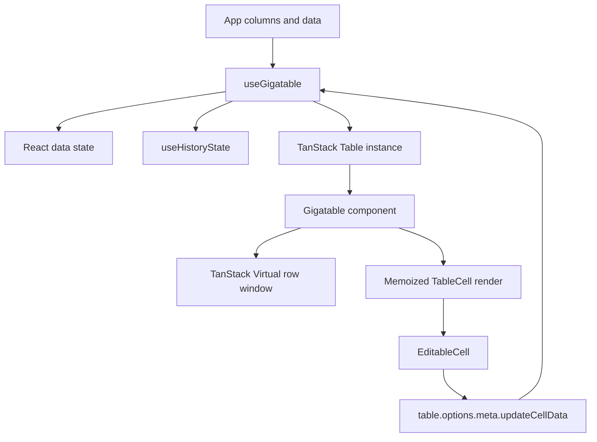
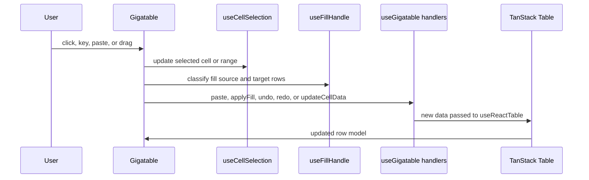

# Architecture

Gigatable is built around TanStack Table for row and column models, TanStack Virtual for row windowing, and local hooks for spreadsheet interactions. The key boundary is between the state hook and the renderer.

## Core data flow

`useGigatable` receives columns and initial data. It stores the current data array, creates `updateCellData`, `paste`, and `applyFill`, and passes `updateCellData` into TanStack Table metadata. `Gigatable` receives the table instance and feature handlers, then renders only the visible row window.

## useGigatable

`useGigatable` owns data mutation. The important internal functions are:

| Function | Responsibility |
| --- | --- |
| `handleSetData` | Central write path. Updates the latest data ref, React state, and history present state when enabled. |
| `updateCellData` | Updates a single row object by row index and column id. Used by `EditableCell`. |
| `applyFill` | Writes one value to a set of row indices for a single column. Used by the fill handle. |
| `handleTablePaste` | Parses clipboard text, maps it onto visible rows and columns, records `PasteResult` changes, and writes updated rows. |

Use this file when the question is "what data gets written?"

## Gigatable

`Gigatable` owns rendering and event coordination. It pulls rows and visible columns from the TanStack instance, resolves the theme into CSS variables, creates the row virtualizer, wires selection/fill hooks, and renders `TableCell` instances.

Use this file when the question is "how does the table respond to an interaction or render a state?"

## Virtualization

Rows are always virtualized. `Gigatable` passes the scroll element to `useVirtualizer`, derives row height from the resolved theme, and renders only virtual rows with an overscan buffer. Cell selection uses stable row ids and column ids instead of DOM position so it can survive virtualization.

This means not every selected cell has a DOM node. Selection and fill logic must tolerate missing refs and update cells when they enter the virtual window.

## Metadata contract

Editable cells do not mutate data directly. They call `table.options.meta.updateCellData(row.index, column.id, value)`. That metadata function is created by `useGigatable`, so edits travel through the same data path as paste and fill changes.

Keep this contract intact unless you are intentionally redesigning how mutations work.

## Render performance

`TableCell` is memoized and compares only the props that should affect a cell render: selected/range/fill state, paste highlight style, cell value, row id, column id, and editability mode. When adding new visual cell state, pass it explicitly and update the memo comparison. Otherwise the cell can fail to redraw or redraw too often.
