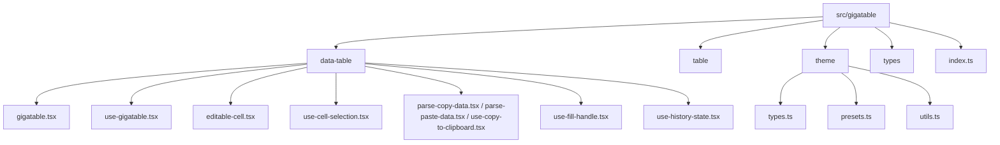

# File Map

This page is a contributor map for the code layout. It focuses on module ownership: what each file is responsible for and where to make common implementation changes.

## Module ownership

## `data-table/`

This directory owns the spreadsheet-like behavior.

| File | What it owns |
| --- | --- |
| `gigatable.tsx` | DOM rendering, virtualization, feature flag wiring, paste highlight state, cell classes, and keyboard shortcuts at the table level. |
| `use-gigatable.tsx` | Data state, `updateCellData`, `paste`, `applyFill`, history integration, and TanStack Table creation. |
| `editable-cell.tsx` | Edit mode, save/cancel behavior, custom input contract, and memoization for editable cells. |
| `use-cell-selection.tsx` | Selected cell, selection range, DOM refs for virtual cells, drag selection, and keyboard navigation. |
| `use-fill-handle.tsx` | Fill drag state, source cell detection, target row calculation, preview values, and mouse lifecycle. |
| `use-history-state.tsx` | Generic past/present/future reducer with undo, redo, clear, and max stack size. |
| `parse-copy-data.tsx` | Turns selected cells into TSV and records the internal copy buffer metadata. |
| `parse-paste-data.tsx` | Parses incoming TSV clipboard text into row and cell arrays. |
| `use-copy-to-clipboard.tsx` | Browser clipboard write helper. |

The most common mistake is changing rendering and state at the same time. First decide whether the bug is a data mutation problem or a view/interaction problem, then work in that owner.

## `table/`

`table/table.tsx` contains the HTML table primitives used by `Gigatable`. These are intentionally thin wrappers around table elements. They centralize class names and overlay support, but they do not own data state or interaction logic.

Change this directory when the shared table markup contract changes. Do not put feature behavior here.

## `theme/`

The theme directory converts a typed `GigatableTheme` object into CSS variables.

| File | What it owns |
| --- | --- |
| `types.ts` | The public token shape grouped by header, row, cell, selection, paste, and fill. |
| `presets.ts` | Built-in presets. Keep them complete and visually distinct. |
| `utils.ts` | `resolveTheme`, default merging, and number-to-pixel conversion. |

Rendering code consumes only CSS variables such as `--gt-row-height` and `--gt-selection-outline`. That keeps visual customization separate from interaction logic.

## `types/`

`types/react-table.d.ts` augments TanStack Table metadata so column definitions can use `meta: { editable: true }`. The root `src/react-table.d.ts` mirrors ambient typing for the app.

If TypeScript rejects `column.columnDef.meta?.editable`, inspect these declarations and the `tsconfig.json` include list before changing component logic.

## Package boundary

`src/gigatable` contains React component source. The sibling `gigatable/` package contains the CLI only. The CLI does not import the React code at runtime; it copies prepared templates into user projects.

| Area | Path | Change it when |
| --- | --- | --- |
| Component internals | `src/gigatable` | Table behavior, rendering, theme tokens, public component exports. |
| Demo site | `src/app.tsx`, `src/pages`, `src/docs` | Local demo, docs, or marketing page changes. |
| CLI installer | `gigatable/src` | `npx gigatable init` validation, prompts, copying, dependency installation. |
| Template sync | `gigatable/scripts` | Publishing or template preparation flow changes. |
