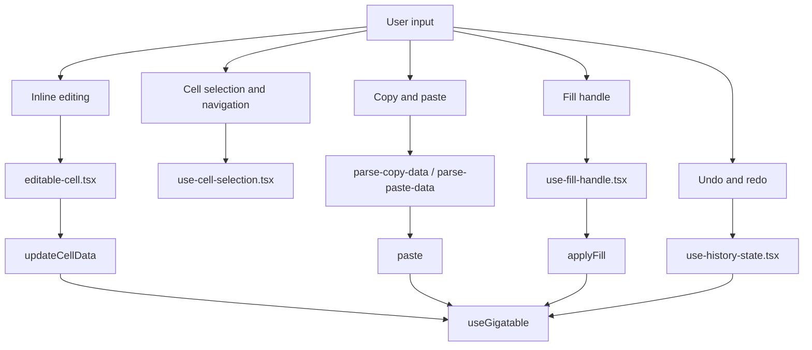
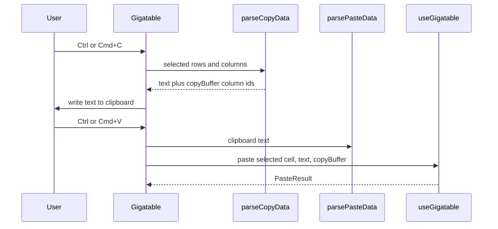

# Interactions

Spreadsheet behavior is split across small hooks. This page explains where each interaction is implemented and how state moves through the component.

## Interaction map

## Selection and navigation

`use-cell-selection.tsx` owns `selectedCell`, `selection`, drag selection, keyboard navigation, and a map of currently mounted cell DOM nodes. The selection model uses `{ rowId, columnId }`, not row or column indexes, because visible rows can change as the virtualizer scrolls.

During drag selection, the hook keeps live state in refs and toggles `.is-in-range` on mounted cells directly. This avoids re-rendering the full table on every pointer movement. React state is committed for stable transitions such as click start, keyboard navigation, or drag end.

Change this hook when arrow keys, shift ranges, drag selection, focus movement, or range membership are wrong.

## Inline editing

`editable-cell.tsx` wraps a TanStack cell context. It starts editing from double click or Enter, renders a caller-provided `renderInput`, and commits through `table.options.meta.updateCellData`.

Key behavior:

| Input | Result |
| --- | --- |
| Enter while selected | Enter edit mode, or save while editing. |
| Tab while editing | Save the value and let focus move. |
| Escape while editing | Cancel and restore the original value. |
| Blur while editing | Save the current value. |

Columns opt in with `meta: { editable: true }`. The `allColumnsEditable` prop in `Gigatable` can wrap non-editable cells in a default text input, but explicit editable columns keep their custom input.

## Clipboard

Copy and paste use TSV because Excel and Google Sheets understand it.

`parse-copy-data.tsx` formats selected values and records the source column ids. `use-gigatable.tsx` uses that copy buffer to preserve source columns for internal paste. External paste maps incoming TSV from the selected cell across visible columns.

## Fill handle

`use-fill-handle.tsx` owns the drag lifecycle for the small handle rendered by `Gigatable`. The source cell must be editable, and fill writes down a single column. During drag, the hook exposes which cells are the source and target range, plus the preview value. On mouse up, `Gigatable` calls `applyFill(columnId, targetRowIndices, value)`.

If a fill preview looks wrong, inspect `use-fill-handle.tsx`. If the preview is correct but data is not written, inspect `applyFill` in `use-gigatable.tsx`.

## Undo and redo

`use-history-state.tsx` is a generic reducer with `past`, `present`, and `future`. `useGigatable` calls `setPresent` from the central `handleSetData` path when `history` is enabled. `Gigatable` only wires keyboard shortcuts to the `undo` and `redo` handlers it receives.

History records data array snapshots, so avoid mutating rows in place. Always return new row objects for changed rows and the old array when nothing changed.
