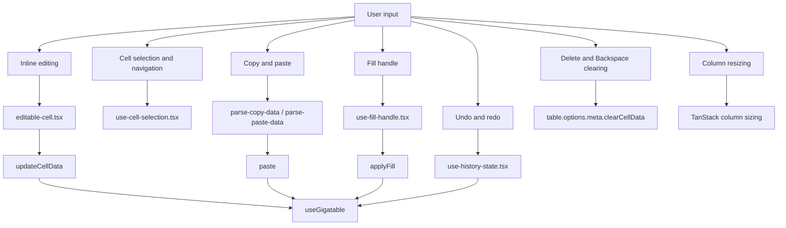
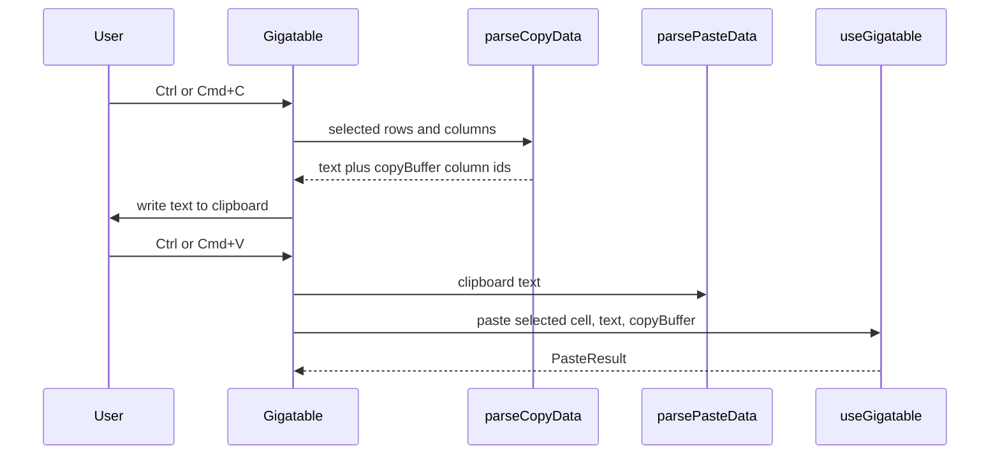

# Interactions

Spreadsheet behavior is split across small hooks. This page explains where each interaction is implemented and how state moves through the component.

## Interaction map

```mermaid
graph TD
  User["User input"]
  User --> Select["Cell selection and navigation"]
  User --> Edit["Inline editing"]
  User --> Clipboard["Copy and paste"]
  User --> Fill["Fill handle"]
  User --> Clear["Delete and Backspace clearing"]
  User --> Resize["Column resizing"]
  User --> History["Undo and redo"]

  Select --> SelectionHook["use-cell-selection.tsx"]
  Edit --> EditableCell["editable-cell.tsx"]
  Clipboard --> CopyPaste["parse-copy-data / parse-paste-data"]
  Fill --> FillHook["use-fill-handle.tsx"]
  Clear --> Metadata["table.options.meta.clearCellData"]
  Resize --> TanStackSizing["TanStack column sizing"]
  History --> HistoryHook["use-history-state.tsx"]

  EditableCell --> Mutation["updateCellData"]
  CopyPaste --> Paste["paste"]
  FillHook --> ApplyFill["applyFill"]
  Mutation --> UseGigatable["useGigatable"]
  Paste --> UseGigatable
  ApplyFill --> UseGigatable
  HistoryHook --> UseGigatable
```

## Selection and navigation

`use-cell-selection.tsx` owns `selectedCell`, `selection`, drag selection, keyboard navigation, and a map of currently mounted cell DOM nodes. The selection model uses `{ rowId, columnId }`, not row or column indexes, because visible rows can change as the virtualizer scrolls.

`Gigatable` decides whether range selection is enabled from `allowRangeSelection || singleColumnCellSelection`. When `singleColumnCellSelection` is true, `use-cell-selection.tsx` clamps range ends back to the anchor column for drag, Shift+Click, and Shift+Arrow while leaving plain click selection and normal arrow navigation unchanged.

During drag selection, the hook keeps live state in refs and toggles `.is-in-range` on mounted cells directly. This avoids re-rendering the full table on every pointer movement. React state is committed for stable transitions such as click start, keyboard navigation, or drag end.

Change this hook when arrow keys, shift ranges, drag selection, focus movement, or range membership are wrong.

## Inline editing

`editable-cell.tsx` wraps a TanStack cell context. It starts editing from double click or Enter, renders a caller-provided `renderInput`, and commits through `table.options.meta.updateCellData`.

Key behavior:

| Input                    | Result                                                  |
| ------------------------ | ------------------------------------------------------- |
| Enter while selected     | Enter edit mode, or save and move down while editing.   |
| Tab while editing        | Save and traverse cells, wrapping between rows.         |
| Escape while editing     | Cancel and restore the original value.                  |
| Blur while editing       | Save the current value.                                 |
| Alt/Option-click or drag | Quick edit or preserve a partial text selection.        |
| Delete or Backspace      | Clear selected editable cells as one history operation. |

Columns opt in with `meta: { editable: true }`. The `allColumnsEditable` prop in `Gigatable` can wrap non-editable cells in a default text input, but explicit editable columns keep their custom input.

## Clipboard

Copy and paste use TSV because Excel and Google Sheets understand it.

```mermaid
sequenceDiagram
  participant User
  participant Gigatable
  participant Copy as parseCopyData
  participant PasteParser as parsePasteData
  participant Hook as useGigatable

  User->>Gigatable: Ctrl or Cmd+C
  Gigatable->>Copy: selected rows and columns
  Copy-->>Gigatable: text plus copyBuffer column ids
  Gigatable->>User: write text to clipboard
  User->>Gigatable: Ctrl or Cmd+V
  Gigatable->>PasteParser: clipboard text
  Gigatable->>Hook: paste selected cell, text, copyBuffer
  Hook-->>Gigatable: PasteResult
```

`parse-copy-data.tsx` formats selected values and records the source column ids. `use-gigatable.tsx` uses that copy buffer to preserve source columns for internal paste. External paste maps incoming TSV from the selected cell across visible columns.

## Fill handle

`use-fill-handle.tsx` owns the drag lifecycle for the small handle rendered by `Gigatable`. The source and target columns must allow editing and fill. The first drag movement locks the axis according to `fillDirection`; vertical fills call `applyFill`, and horizontal fills call `applyHorizontalFill`.

If a fill preview looks wrong, inspect `use-fill-handle.tsx`. If the preview is correct but data is not written, inspect `applyFill` in `use-gigatable.tsx`.

## Column resizing

Column resizing is delegated to TanStack Table. Consumers enable sizing on `useGigatable` with options such as `enableColumnResizing`, `columnResizeMode`, `state.columnSizing`, and `onColumnSizingChange`. `Gigatable` renders the header resize handle only when `allowColumnResizing` is true and the column reports `getCanResize()`.

The resize handle calls `header.getResizeHandler()` for mouse and touch input, stops propagation so drag selection does not start, and double-clicks call `header.column.resetSize()`. Width persistence belongs to the consuming app through TanStack `columnSizing` state.

## Undo and redo

`use-history-state.tsx` is a generic reducer with `past`, `present`, and `future`. `useGigatable` calls `setPresent` from the central `handleSetData` path when `history` is enabled. `Gigatable` only wires keyboard shortcuts to the `undo` and `redo` handlers it receives.

History records data array snapshots, so avoid mutating rows in place. Always return new row objects for changed rows and the old array when nothing changed.

Source-data reference changes call `reset(data)`, clearing stale undo and redo
entries. Clear, paste, and fill each use the same batched mutation path.

## Compound rendering

Delegated mouse and keyboard handling lives on the composed table boundary.
`Gigatable.Cell` supplies the required data attributes and refs.
`useGigatableContext` lets custom bodies read table models and register their
own row scroller; always use the registration cleanup.
