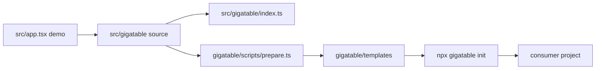

# Internals Overview

[View on DeepWiki](https://deepwiki.com/aikenahac/gigatable)

These contributor docs explain how the code in `src/gigatable` is written, where responsibilities live, and how the implementation pieces cooperate.

## Source of truth

`src/gigatable` is the canonical component source. The demo app imports from it directly, and the CLI package copies this source into consumer projects during template preparation.

When you change component behavior, start in `src/gigatable`. When you change how the installer works, start in `gigatable/src`. When you change the docs site, start in `src/docs`, `src/pages`, or `src/site`.

## Public surface

The public barrel in `src/gigatable/index.ts` exports the pieces consumers are expected to use:

| Export | Owner | Purpose |
| --- | --- | --- |
| `Gigatable` | `data-table/gigatable.tsx` | Renders the virtualized grid and wires user interactions. |
| `useGigatable` | `data-table/use-gigatable.tsx` | Owns table data mutation, history integration, paste, and fill application. |
| `EditableCell` | `data-table/editable-cell.tsx` | Switches a TanStack cell between display and edit modes. |
| `themes` | `theme/presets.ts` | Built-in visual presets. |
| Types | `data-table`, `theme`, `types` | Props, result objects, cell coordinates, and theme contracts. |

Keep the barrel stable unless you intend to change the consumer API. Most contributor work should happen behind this surface.

## Runtime model

Gigatable has two halves:

| Layer | Code | Responsibility |
| --- | --- | --- |
| State layer | `use-gigatable.tsx` | Holds row data, exposes mutation helpers, creates the TanStack Table instance. |
| View layer | `gigatable.tsx` | Renders headers, virtual rows, memoized cells, keyboard/mouse handlers, and visual overlays. |

The view layer calls handlers supplied by the state layer. The state layer updates data and gives TanStack Table a new row model. This split is the main implementation boundary.

## Contributor mindset

Before changing behavior, identify which subsystem owns it:

| Change | First files to inspect |
| --- | --- |
| A value changes in row data | `use-gigatable.tsx`, then the caller such as paste, fill, or edit. |
| A cell looks selected, highlighted, or editable | `gigatable.tsx`, `use-cell-selection.tsx`, theme variables. |
| Keyboard or mouse movement changes | `use-cell-selection.tsx` or `use-fill-handle.tsx`. |
| A type is missing on column definitions | `types/react-table.d.ts` and `src/react-table.d.ts`. |
| A CLI install behavior changes | `gigatable/src/commands/init.ts` and `gigatable/src/utils`. |

Prefer small, owner-aligned changes. The implementation is optimized around stable refs, memoized cells, and virtualized rows, so broad refactors can easily cause extra renders or stale interaction state.
