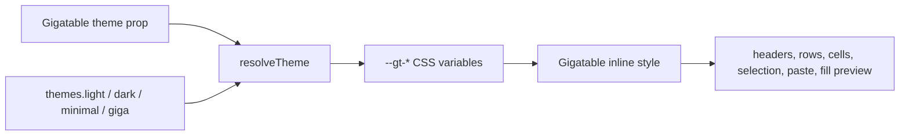
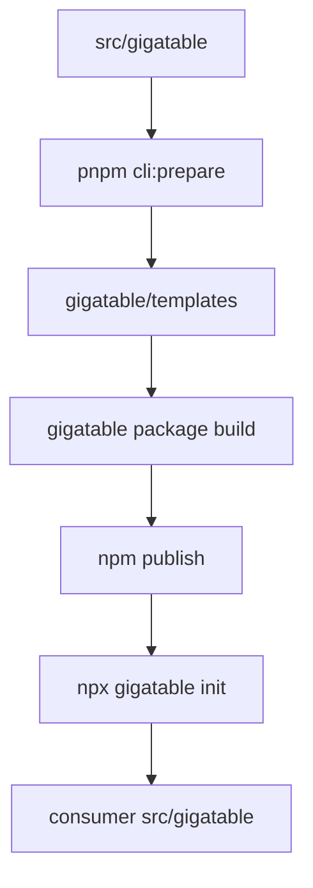

# Theming and Distribution

This page covers two implementation systems that sit around the core table: theme resolution and CLI distribution.

## Theme pipeline



`GigatableTheme` is a partial object. `resolveTheme` merges it over the light preset and returns CSS custom properties. Numeric size values are converted to pixel strings, which lets contributors write theme presets with either `30` or `"30px"` for size-like fields.

## Token ownership

| Theme group | Used for |
| --- | --- |
| `header` | Header background, text, border, height, font size, family, weight. |
| `row` | Row height, background, and hover background. |
| `cell` | Cell border, text, font, and padding. |
| `selection` | Active cell outline and range background. |
| `paste` | Paste highlight fill and border. |
| `fill` | Fill preview background and preview text color. |

Rendering should consume `var(--gt-*)` values instead of reading theme objects directly. That keeps the renderer simple and makes CSS overrides possible.

## Type augmentation

TanStack Table columns use `columnDef.meta` for Gigatable-specific editability:

```ts
meta: { editable: true }
```

The augmentation lives in `src/gigatable/types/react-table.d.ts`, with a root app declaration in `src/react-table.d.ts`. If a contributor adds new column metadata, extend the augmentation and update docs/API references together.

## Distribution model

Gigatable is distributed as source, not as a precompiled React component package. The CLI package is a source installer.



The `gigatable/` package owns CLI behavior:

| File | Responsibility |
| --- | --- |
| `gigatable/src/cli/index.ts` | CLI entry point. |
| `gigatable/src/commands/init.ts` | Project validation, prompts, copying templates, and dependency installation. |
| `gigatable/src/utils/detect-pm.ts` | Package manager detection from lockfiles. |
| `gigatable/src/utils/detect-ts.ts` | TypeScript project detection. |
| `gigatable/src/utils/detect-tw.ts` | Tailwind CSS dependency detection. |
| `gigatable/scripts/prepare.ts` | Template preparation before build or publish. |
| `gigatable/scripts/deploy.ts` | Prepare, build, and publish workflow. |

## Contributor checklist

When changing `src/gigatable`, check whether the CLI templates need to be refreshed before publishing. When changing CLI detection or install behavior, update tests under `gigatable/src/utils/__tests__` or add coverage around `init` behavior if the change is user visible.

For theme changes, update `theme/types.ts`, `theme/presets.ts`, `theme/utils.ts`, and `theme/utils.test.ts` as a set. The resolver tests are the guardrail for keeping CSS variables complete.
